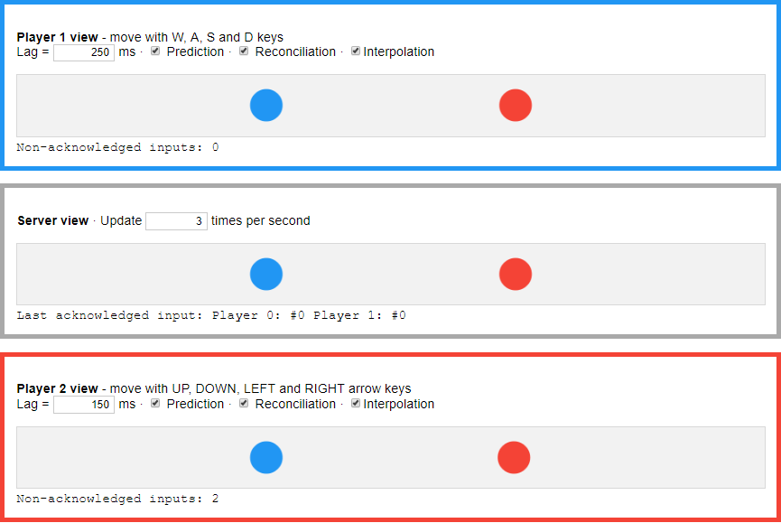

# What is it?

This is a Typescript port of a Javascript demo from [http://www.gabrielgambetta.com/client-side-prediction-live-demo.html](http://www.gabrielgambetta.com/client-side-prediction-live-demo.html).

On their excellent website it is explained how to create a "Fast-Paced Multiplayer Game" even with bad network conditions (such as over the internet).

This version of the demo was created to make the code even more readable (and as a basis for following projects which involve real servers.)

As the original author said "[...] you may use this code in your own applications. Credit is appreciated although not required.".

# Install
1. yarn install
2. yarn start
   
# Demovideo
